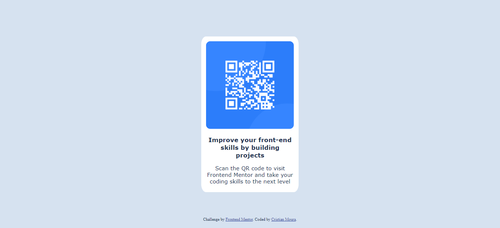

# Frontend Mentor - QR code component solution

This is a solution to the [QR code component challenge on Frontend Mentor](https://www.frontendmentor.io/challenges/qr-code-component-iux_sIO_H). Frontend Mentor challenges help you improve your coding skills by building realistic projects. 

## Table of contents

- [Overview](#overview)
  - [Screenshot](#screenshot)
  - [Links](#links)
- [My process](#my-process)
  - [Built with](#built-with)
  - [What I learned](#what-i-learned)
- [Author](#author)

## Overview

### Screenshots

### Links

- Solution URL: [Frontend Mentor](https://www.frontendmentor.io/solutions/responsive-qr-component-dwj-zb062)
- Live Site URL: [Vercel](https://frontend-challenges-dusky.vercel.app/)

## My process

### Built with

- Semantic HTML5 markup
- CSS custom properties
- Flexbox
- CSS Grid

### What I learned

Learned concepts about poisitioning, resizing and responsiveness, as well as styling a card component. 

## Author

- Website - Christian Moura
- Frontend Mentor - [@cdbm](https://www.frontendmentor.io/profile/cdbm)
- Twitter - [@_cdbm](https://twitter.com/_cdbm)
